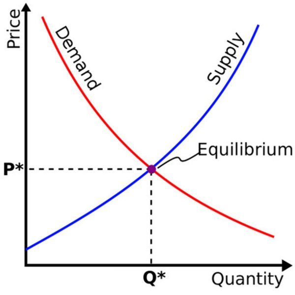

# 經濟學

### 以需求為中心

#### 當利潤被定義為創作價值（文章、攻略需求）時，使用者會為此付費。我們專注於建立長期資訊平台，這也是我們選擇資訊平台的原因之一。我們關注不同人群對遊戲資訊與攻略的需求。

#### \*\*但是，我們需要確保創作者從根本上通過滿足其他使用者的需求來獲得利潤。\*\*上述兩種行為是造成非理性繁榮的核心手段，在人類社會歷史上屢屢出現。

#### 在Electroic中，創作者是經濟體系的重要組成部分。通過市場供應與需求效應，將創作者的創作價值完整的體現出來，藉此吸引項目以及外部資金投入，這將有助於提升經濟效應。

(不管是項目本身 還是市場需求 這都有助於整個市場的基礎成長)

#### 資訊平台解決了什麼問題？滿足了人們的甚麼需求？

#### 所有「產品」都有其重點問題需要解決，例如iPhone，汽車，cookie等。用戶為什麼會來到這個平台？

#### 我們在平台中有各式各樣的分工，目前包括創作者、使用者和社區。

#### 在Electroic中，官方機構不是這個平台的主體，我們只提供一個創作者平台，資訊平台，遊戲資訊平台，平台上的所有行為都將是玩家行為。一個資訊的匯集平台，提供的資訊便利性，在許多“Web2”遊戲平台（如《巴哈姆特》和《bilibili》）已經驗證了這類平台的可行性。

#### 在Electroic中，具有不同需求的使用者扮演著不同的角色，既是供應者，也是需求者。這些角色共同作用，形成了一個有機的經濟系統。

<figure><figcaption></figcaption></figure>

### 互通性 

Web3 遊戲社群與官方 消息的互通性最容易產生誤會與矛盾的地方。

* 我們建立一個具有即時回復的AI回復功能，能夠統整現有的文章問題來回復用戶的問題。
* 項目方可以透過這些數據精準的解決當下所需要即時解決的問題。

